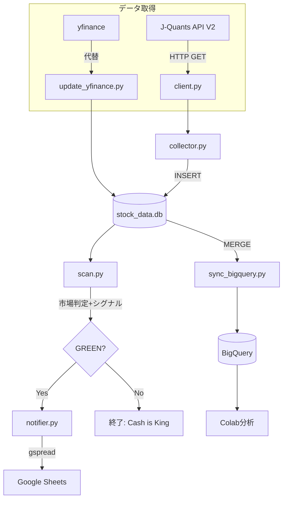
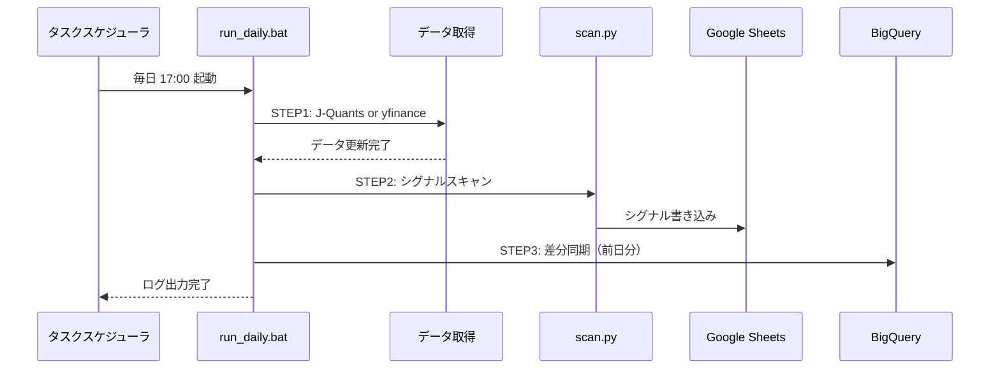

# jquants-stock-collector アーキテクチャ

## プロジェクト概要

J-Quants APIを使用して日本株データを収集・分析し、NISA向け小型株トレンドフォロー戦略のシグナルを生成するシステム。

---

## ディレクトリ構造

```
jquants-stock-collector/
├── main.py                  # エントリポイント（J-Quantsデータ収集）
├── run_daily.bat            # 日次自動実行バッチ
├── requirements.txt         # 依存ライブラリ
├── stock_data.db            # SQLiteデータベース（約1.3GB）
├── daily_operation.log      # 運用ログ
├── secret_key.json          # GCPサービスアカウントキー（git対象外）
├── .env                     # 環境変数（git対象外）
├── src/
│   ├── client.py            # J-Quants APIクライアント
│   ├── collector.py         # データ収集ロジック
│   ├── database.py          # SQLiteデータベース操作
│   ├── scan.py              # 日次シグナルスキャナー
│   ├── notifier.py          # Google Sheets通知
│   ├── update_yfinance.py   # yfinance日次データ更新（J-Quants代替）
│   ├── sync_bigquery.py     # BigQuery差分同期
│   ├── export_bigquery.py   # BigQuery全量エクスポート
│   ├── backtest.py          # バックテストエンジン（WFA版）
│   └── backtest_portfolio.py # ポートフォリオバックテスト
├── notebooks/
│   └── bigquery_analysis_template.md  # Colab分析テンプレート
└── docs/
    ├── ARCHITECTURE.md
    ├── implementation_plan.md
    ├── task.md
    └── walkthrough.md
```

---

## データフロー



---

## 日次運用フロー



---

## モジュール詳細

### データ取得系

| モジュール | 説明 | データソース |
|-----------|------|-------------|
| `main.py` + `collector.py` | J-Quantsからデータ収集 | J-Quants API V2 |
| `update_yfinance.py` | J-Quants代替データ取得 | Yahoo Finance |

### シグナル生成系

| モジュール | 説明 | 出力先 |
|-----------|------|--------|
| `scan.py` | 市場環境判定+シグナル抽出 | コンソール |
| `notifier.py` | シグナルをスプレッドシートに書き込み | Google Sheets |

### BigQuery連携系

| モジュール | 説明 | 処理 |
|-----------|------|------|
| `export_bigquery.py` | 全量エクスポート | SQLite → BigQuery (REPLACE) |
| `sync_bigquery.py` | 差分同期（日次） | 前日分のみ MERGE |

---

## Golden Configuration

| パラメータ | 値 | 説明 |
|-----------|-----|------|
| `DIP_THRESHOLD` | 0.97 | 押し目閾値（MA25の97%以下で買い） |
| `MARKET_BULLISH_THRESHOLD` | 0.40 | 市場環境フィルター（40%以上で買い許可） |
| `STOP_LOSS_PCT` | 0.05 | 損切り -5% |
| `TRAILING_STOP_PCT` | 0.10 | トレーリングストップ -10% |
| `MAX_POSITIONS` | 20 | 最大保有銘柄数（1銘柄5%） |

---

## 環境設定

### 必要な環境変数 (.env)
```
JQUANTS_API_KEY=your_api_key_here
```

### 依存ライブラリ (requirements.txt)
```
jquants-api-client>=2.0.0
pandas>=2.0.0
python-dotenv>=1.0.0
tqdm>=4.65.0
gspread>=5.10.0
google-auth>=2.20.0
yfinance>=1.0
pandas-gbq>=0.19.0
```

### GCP設定
- **プロジェクトID:** nisa-jquant
- **BigQueryデータセット:** stock_data
- **テーブル:** prices, fundamentals

---

## run_daily.bat 設定

```batch
:: データソース選択
set USE_YFINANCE=0  :: J-Quants使用
set USE_YFINANCE=1  :: yfinance使用（解約後）
```

---

## リポジトリ

- **GitHub:** https://github.com/yke-t/jquants-stock-collector
