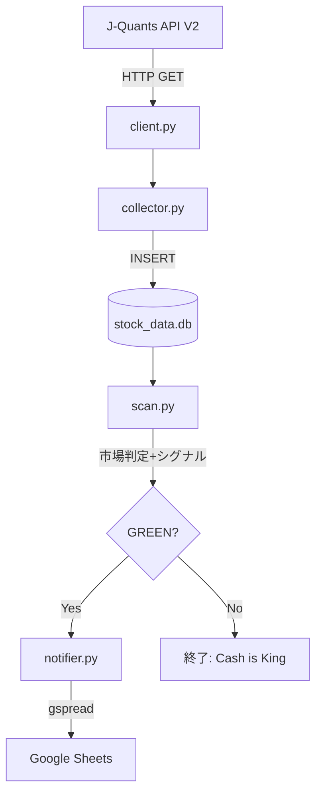
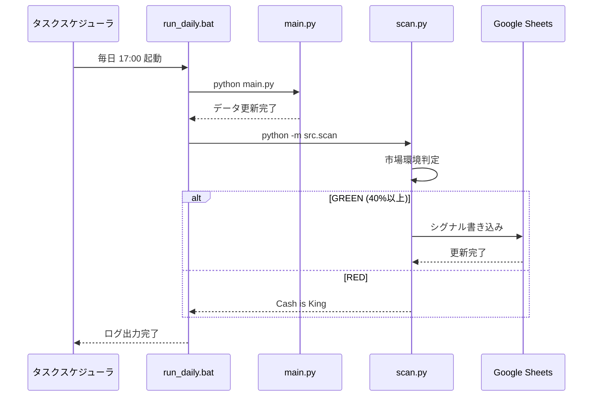

# jquants-stock-collector アーキテクチャ

## プロジェクト概要

J-Quants APIを使用して日本株データを収集・分析し、NISA向け小型株トレンドフォロー戦略のシグナルを生成するシステム。

---

## ディレクトリ構造

```
jquants-stock-collector/
├── main.py                  # エントリポイント（データ収集）
├── run_daily.bat            # 日次自動実行バッチ
├── requirements.txt         # 依存ライブラリ
├── stock_data.db            # SQLiteデータベース（約1.3GB）
├── daily_operation.log      # 運用ログ
├── secret_key.json          # GCPサービスアカウントキー（git対象外）
├── .env                     # 環境変数（git対象外）
├── src/
│   ├── client.py            # J-Quants APIクライアント
│   ├── collector.py         # データ収集ロジック
│   ├── database.py          # SQLiteデータベース操作
│   ├── scan.py              # 日次シグナルスキャナー
│   ├── notifier.py          # Google Sheets通知
│   ├── backtest.py          # バックテストエンジン（WFA版）
│   └── backtest_portfolio.py # ポートフォリオバックテスト
└── docs/
    ├── implementation_plan.md
    ├── task.md
    └── walkthrough.md
```

---

## データフロー



---

## モジュール詳細

### 1. `main.py` - エントリポイント

データ収集のメインスクリプト。

```
Usage:
  python main.py --start 2014-01-01
  python main.py --start 2024-01-01 --end 2024-12-23
  python main.py --start 2024-01-01 --no-resume
```

| 引数 | 説明 | デフォルト |
|------|------|-----------|
| `--start` | 開始日 (YYYY-MM-DD) | 2014-01-01 |
| `--end` | 終了日 (YYYY-MM-DD) | 今日 |
| `--db` | DBファイルパス | stock_data.db |
| `--no-resume` | 中断再開しない | False |

---

### 2. `src/client.py` - J-Quants APIクライアント

J-Quants API V2に対応したHTTPクライアント。

**クラス:** `JQuantsClient`

| メソッド | 説明 |
|----------|------|
| `get(endpoint, params)` | 汎用GETリクエスト（リトライ/レートリミット対応） |
| `get_listed_info()` | 銘柄一覧取得 (`/equities/master`) |
| `get_daily_quotes(date, code)` | 日足データ取得 (`/equities/bars/daily`) |
| `get_financial_summary(code)` | 財務情報取得 (`/fins/summary`) |

**認証:** 環境変数 `JQUANTS_API_KEY` を `x-api-key` ヘッダーで送信。

---

### 3. `src/collector.py` - データ収集ロジック

大量データの効率的収集。中断再開機能とtqdmによる進捗表示。

**クラス:** `DataCollector`

| メソッド | 説明 |
|----------|------|
| `run(start_date, end_date, resume)` | 指定期間のデータを日次で取得・保存 |

**処理フロー:**
1. 銘柄マスタ取得 → `fundamentals`テーブルに保存
2. 日次ループで株価取得 → `prices`テーブルに保存
3. 土日スキップ、レートリミット対策（1秒待機）
4. 進捗を`sync_progress`テーブルに記録

---

### 4. `src/database.py` - SQLiteデータベース操作

株価・財務データのCRUD操作。

**クラス:** `StockDatabase`

| メソッド | 説明 |
|----------|------|
| `save_daily_quotes(df)` | 日足データを保存（UPSERT） |
| `save_fundamentals(df)` | 財務情報を保存 |
| `get_sync_progress(table)` | 同期進捗を取得 |
| `update_sync_progress(table, date)` | 同期進捗を更新 |
| `get_price_count()` | 株価レコード数を取得 |

**テーブル構造:**
- `prices`: 日足データ（date, code, OHLCV, 調整値）
- `fundamentals`: 銘柄マスタ（code, 社名, セクター, scalecat等）
- `sync_progress`: 同期進捗（テーブル名, 最終同期日）

---

### 5. `src/scan.py` - 日次シグナルスキャナー

毎日実行し、市場環境判定と買い候補を出力。

**関数:** `analyze_market()`

**Golden Configuration（固定パラメータ）:**
| パラメータ | 値 | 説明 |
|-----------|-----|------|
| `DIP_THRESHOLD` | 0.97 | 押し目閾値（MA25の97%以下で買い） |
| `MARKET_BULLISH_THRESHOLD` | 0.40 | 市場環境フィルター（40%以上で買い許可） |
| `STOP_LOSS_PCT` | 0.05 | 損切り -5% |

**処理フロー:**
1. 直近100日のデータをロード
2. 移動平均線（MA25, MA75）を計算
3. **市場環境判定**: MA75超え銘柄の割合が40%以上なら GREEN
4. **シグナル抽出**: GC形成中 かつ MA25の97%以下まで押した銘柄
5. **Google Sheets通知**: 上位20銘柄をスプレッドシートに出力

---

### 6. `src/notifier.py` - Google Sheets通知

シグナルデータをスプレッドシートに書き込む。

**関数:** `update_signal_sheet(signal_data, spreadsheet_key)`

**出力カラム:**
| カラム | 説明 |
|--------|------|
| 更新日時 | スキャン実行時刻 |
| 銘柄コード | 証券コード |
| 銘柄名 | 会社名 |
| 現在値 | 終値 |
| MA25乖離率(%) | MA25からの乖離率 |
| 損切りライン | 現在値 × 0.95 |
| 利確目標(MA25) | MA25の値 |

**認証:** サービスアカウントキー（`secret_key.json`）

---

### 7. `src/backtest.py` - バックテストエンジン（WFA版）

ウォークフォワード分析（WFA）による戦略検証。

**クラス:** `NisaJQuantBacktester`

| メソッド | 説明 |
|----------|------|
| `load_data(start_date)` | DBからデータ読み込み |
| `calculate_indicators(df, ma_short, ma_long)` | テクニカル指標計算 |
| `run_strategy(df, params)` | 戦略ロジック実行 |
| `walk_forward_analysis(n_splits)` | WFA実行 |
| `calculate_kpi(trades)` | KPI評価 |

---

### 8. `src/backtest_portfolio.py` - ポートフォリオバックテスト

Golden Configuration確定版。実際の資金管理をシミュレート。

**クラス:** `PortfolioBacktester`

**Coward's Strategy（臆病者の戦略）:**
| パラメータ | 値 | 説明 |
|-----------|-----|------|
| `INITIAL_CAPITAL` | 300万円 | 初期資金 |
| `MAX_POSITIONS` | 20 | 最大保有銘柄数（1銘柄5%） |
| `STOP_LOSS_PCT` | 0.05 | 損切り -5% |
| `TRAILING_STOP_PCT` | 0.10 | トレーリングストップ -10% |
| `DIP_THRESHOLD` | 0.97 | 押し目閾値 |
| `MARKET_BULLISH_THRESHOLD` | 0.40 | 市場環境フィルター |

**最終KPI:**
- CAGR: 14.15% (目標: 15%)
- Max Drawdown: -26.37% (目標: -20%)

---

## 日次運用フロー



---

## 環境設定

### 必要な環境変数 (.env)
```
JQUANTS_API_KEY=your_api_key_here
```

### 依存ライブラリ (requirements.txt)
```
jquants-api-client>=2.0.0
pandas>=2.0.0
python-dotenv>=1.0.0
tqdm>=4.65.0
gspread>=5.10.0
google-auth>=2.20.0
```

---

## リポジトリ

- **GitHub:** https://github.com/yke-t/jquants-stock-collector
